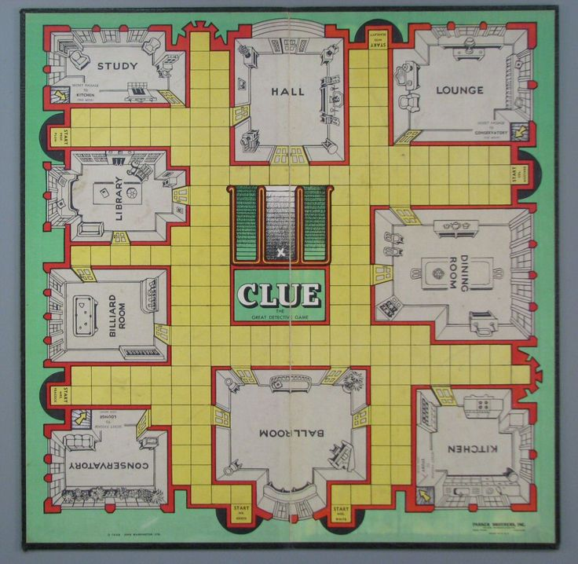
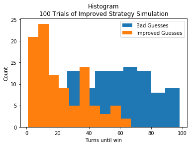

# Validating a Clue Strategy

<br><br>
<div align='center'></img></div>
<br><br>
A detailed account of my cousin's strategy for playing clue is described in the Python notebook contained in this repository. Sample output from the simulation that was used to validate that strategy is found below.
<br><br>
<div align='center'></img></div>
<br><br>

```
--------------------DICK--------------------
dick is nearest to conservatory and their token is peacock
Best path is from conservatory to conservatory.
dick thinks best guess is currently: white in the conservatory with the wrench
outer, inner: 0, 1
dick asking quincy if they have ['white', 'conservatory', 'wrench']
quincy has ['hall', 'lounge', 'billiard']
Current hint is None
outer, inner: 0, 2
dick asking alicia if they have ['white', 'conservatory', 'wrench']
alicia has ['plum', 'peacock', 'revolver']
Current hint is None
outer, inner: 0, 3
dick asking tigger if they have ['white', 'conservatory', 'wrench']
tigger has ['ballroom', 'conservatory', 'kitchen']
Current hint is conservatory
dick guesses white in the conservatory with the wrench
Visted outer loop 1 times
--------------------QUINCY--------------------
quincy is nearest to study and their token is plum
Best path is from study to study.
quincy thinks best guess is currently: white in the study with the wrench
outer, inner: 1, 5
quincy asking mbali if they have ['white', 'study', 'wrench']
mbali has ['candlestick', 'scarlet', 'study']
Current hint is study
quincy guesses white in the study with the wrench
Visted outer loop 2 times
--------------------ALICIA--------------------
alicia is nearest to ballroom and their token is white
Best path is from ballroom to ballroom.
alicia thinks best guess is currently: white in the ballroom with the wrench
outer, inner: 2, 1
alicia asking quincy if they have ['white', 'ballroom', 'wrench']
quincy has ['hall', 'lounge', 'billiard']
Current hint is None
outer, inner: 2, 2
alicia asking alicia if they have ['white', 'ballroom', 'wrench']
alicia has ['plum', 'peacock', 'revolver']
Current hint is None
outer, inner: 2, 3
alicia asking tigger if they have ['white', 'ballroom', 'wrench']
tigger has ['ballroom', 'conservatory', 'kitchen']
Current hint is ballroom
alicia guesses white in the ballroom with the wrench
Visted outer loop 3 times
--------------------TIGGER--------------------
tigger is nearest to lounge and their token is scarlet
Best path is from lounge to lounge.
tigger thinks best guess is currently: white in the lounge with the wrench
outer, inner: 3, 5
tigger asking mbali if they have ['white', 'lounge', 'wrench']
mbali has ['candlestick', 'scarlet', 'study']
Current hint is None
outer, inner: 3, 0
tigger asking dick if they have ['white', 'lounge', 'wrench']
dick has ['pipe', 'library', 'mustard']
Current hint is None
outer, inner: 3, 1
tigger asking quincy if they have ['white', 'lounge', 'wrench']
quincy has ['hall', 'lounge', 'billiard']
Current hint is lounge
tigger guesses white in the lounge with the wrench
Visted outer loop 4 times
--------------------COOKIE--------------------
cookie is nearest to ballroom and their token is green
Best path is from ballroom to ballroom.
cookie thinks best guess is currently: white in the ballroom with the wrench
outer, inner: 4, 3
cookie asking tigger if they have ['white', 'ballroom', 'wrench']
tigger has ['ballroom', 'conservatory', 'kitchen']
Current hint is ballroom
cookie guesses white in the ballroom with the wrench
Visted outer loop 5 times
--------------------MBALI--------------------
mbali is nearest to dining and their token is mustard
Best path is from dining to dining.
mbali thinks best guess is currently: white in the dining with the wrench
outer, inner: 5, 5
mbali asking mbali if they have ['white', 'dining', 'wrench']
mbali has ['candlestick', 'scarlet', 'study']
Current hint is None
outer, inner: 5, 0
mbali asking dick if they have ['white', 'dining', 'wrench']
dick has ['pipe', 'library', 'mustard']
Current hint is None
outer, inner: 5, 1
mbali asking quincy if they have ['white', 'dining', 'wrench']
quincy has ['hall', 'lounge', 'billiard']
Current hint is None
outer, inner: 5, 2
mbali asking alicia if they have ['white', 'dining', 'wrench']
alicia has ['plum', 'peacock', 'revolver']
Current hint is None
outer, inner: 5, 3
mbali asking tigger if they have ['white', 'dining', 'wrench']
tigger has ['ballroom', 'conservatory', 'kitchen']
Current hint is None
outer, inner: 5, 4
mbali asking cookie if they have ['white', 'dining', 'wrench']
cookie has ['knife', 'green', 'wrench']
Current hint is wrench
mbali guesses white in the dining with the wrench
Visted outer loop 6 times
--------------------DICK--------------------
dick is nearest to conservatory and their token is peacock
Best path is from conservatory to lounge.
dick thinks best guess is currently: scarlet in the lounge with the rope
outer, inner: 0, 0
dick asking dick if they have ['scarlet', 'lounge', 'rope']
dick has ['pipe', 'library', 'mustard']
Current hint is None
outer, inner: 0, 1
dick asking quincy if they have ['scarlet', 'lounge', 'rope']
quincy has ['hall', 'lounge', 'billiard']
Current hint is lounge
dick guesses scarlet in the lounge with the rope
Visted outer loop 7 times
--------------------QUINCY--------------------
quincy is nearest to study and their token is plum
Best path is from study to kitchen.
quincy thinks best guess is currently: scarlet in the kitchen with the rope
outer, inner: 1, 3
quincy asking tigger if they have ['scarlet', 'kitchen', 'rope']
tigger has ['ballroom', 'conservatory', 'kitchen']
Current hint is kitchen
quincy guesses scarlet in the kitchen with the rope
Visted outer loop 8 times
--------------------ALICIA--------------------
alicia is nearest to ballroom and their token is white
Best path is from ballroom to conservatory.
alicia thinks best guess is currently: scarlet in the conservatory with the rope
outer, inner: 2, 5
alicia asking mbali if they have ['scarlet', 'conservatory', 'rope']
mbali has ['candlestick', 'scarlet', 'study']
Current hint is scarlet
alicia guesses scarlet in the conservatory with the rope
Visted outer loop 9 times
--------------------TIGGER--------------------
tigger is nearest to lounge and their token is scarlet
Best path is from lounge to conservatory.
tigger thinks best guess is currently: scarlet in the conservatory with the rope
outer, inner: 3, 1
tigger asking quincy if they have ['scarlet', 'conservatory', 'rope']
quincy has ['hall', 'lounge', 'billiard']
Current hint is None
outer, inner: 3, 2
tigger asking alicia if they have ['scarlet', 'conservatory', 'rope']
alicia has ['plum', 'peacock', 'revolver']
Current hint is None
outer, inner: 3, 3
tigger asking tigger if they have ['scarlet', 'conservatory', 'rope']
tigger has ['ballroom', 'conservatory', 'kitchen']
Current hint is conservatory
tigger guesses scarlet in the conservatory with the rope
Visted outer loop 10 times
--------------------COOKIE--------------------
cookie is nearest to ballroom and their token is green
Best path is from ballroom to conservatory.
cookie thinks best guess is currently: scarlet in the conservatory with the rope
outer, inner: 4, 5
cookie asking mbali if they have ['scarlet', 'conservatory', 'rope']
mbali has ['candlestick', 'scarlet', 'study']
Current hint is scarlet
cookie guesses scarlet in the conservatory with the rope
Visted outer loop 11 times
--------------------MBALI--------------------
mbali is nearest to dining and their token is mustard
Best path is from dining to dining.
mbali thinks best guess is currently: white in the dining with the rope
We have a winner! mbali guessed white in the dining with the rope in 12 turns
```
